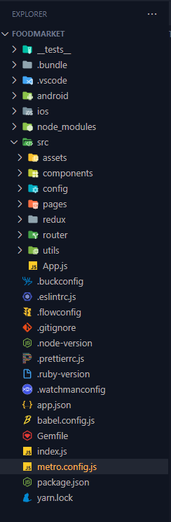

# Documentation Belajar React Native Version Boody-man


##  Penggunaan SVG
####bahan / link instalation:

 [](https://github.com/react-native-svg/react-native-svg)

 [](https://github.com/kristerkari/react-native-svg-transformer)
- install `react-native-svg`
```md
yarn add react-native-svg
```
```md
yarn add --dev react-native-svg-transformer
```
- lalu copykan file dibawah ini pada folder `metro.config.js`
```md
const { getDefaultConfig } = require("metro-config");

module.exports = (async () => {
  const {
    resolver: { sourceExts, assetExts }
  } = await getDefaultConfig();
  return {
    transformer: {
      babelTransformerPath: require.resolve("react-native-svg-transformer")
    },
    resolver: {
      assetExts: assetExts.filter(ext => ext !== "svg"),
      sourceExts: [...sourceExts, "svg"]
    }
  };
})();
```


##Struktur Folder Project React Native Boody-man

perhatikan struktur folder yang ada didalam `src`
- didalam folder `assets` berisi file statis seperti gambar,icon dll (Dummy,icon,illustration).
- didalm folder `components` berisi folder `atom` & `molecules` didalam `atom` berisi tag react native sedangkan didalam `molecules` berisi komponen React Native seperti `Header` dll.
- didalam folder `pages` berisi kompoenen tampilan project kita _contoh:SplashScreeen, SignUp, SignIn_ intinya berisi satu view dalam 1 file.
